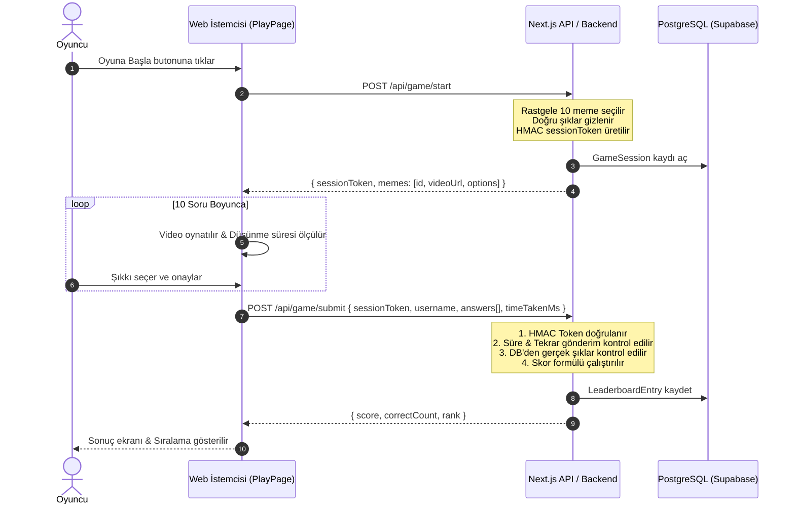

# 🎮 HSD Karabük — Meme Guesser

<div align="center">


**Huawei Student Developers (HSD) Karabük Üniversitesi** stand etkinlikleri için geliştirilmiş; popüler Türkçe ve global YouTube meme kliplerini içeren, zamana karşı yarışılan interaktif tahmin oyunu.

[Canlı Demo](#) • [Özellikler](#-özellikler) • [Mimari & Güvenlik](#-mimari-ve-anti-cheat-sistemi) • [Kurulum](#-kurulum-ve-%C3%A7al%C4%B1%C5%9Ft%C4%B1rma)

</div>

---

## 📌 Proje Hakkında

**Meme Guesser**, üniversite stand etkinliklerinde katılımcıların ilgisini çekmek ve eğlenceli bir rekabet ortamı yaratmak amacıyla tasarlanmış bir web oyunudur. 

Oyuncular, 10 farklı meme klibinden kesitler izler ve verilen 4 seçenek arasından doğru meme'i en kısa sürede tahmin etmeye çalışır. Oyun; hile korumalı mimarisi, dinamik ses ve zamanlama kontrolleri, stand akışına özel 3 saatlik periyotlarla sıfırlanan canlı liderlik tablosu ile eksiksiz bir etkinlik deneyimi sunar.

---

## ✨ Özellikler

- 🎬 **YouTube Iframe Entegrasyonu**: Klipler belirlenen başlangıç (`startTime`) ve bitiş (`endTime`) saniyeleri arasında hassas olarak oynatılır.
- 🎵 **Dinamik Ses & Müzik Yönetimi**: Soru ekranında gerilimli arka plan müziği otomatik devreye girer; cevap aşamasında durur. Kullanıcı dostu sessize alma (mute/unmute) desteği mevcuttur.
- 🛡️ **HMAC Tabanlı Anti-Cheat Mimarisi**: Oturumlar server tarafında imzalanır (`sessionToken`). Doğru cevaplar istemciye (client) asla sızdırılmaz ve skor tamamen server-side hesaplanır.
- ⏱️ **Adil Düşünme Zamanlayıcısı**: Video izleme süresi hesaba katılmaz; yalnızca soru ekranında geçirilen düşünme süresi (`mm:ss.t`) puanlamaya etki eder.
- 🏆 **Stand Modu Liderlik Tablosu**: 3 saatlik dinamik periyotlarla otomatik sıfırlanan, anlık sıralama ve geri sayım sayacına sahip canlı skor tahtası.
- 🔞 **Türkçe Küfür & Argo Filtresi**: Oyuncu adları 90pixel algoritması ile taranarak argo veya uygunsuz girişler engellenir.
- 🛠️ **Gelişmiş Yönetici (Backoffice) Paneli**: YouTube linkinden tek tıkla meme ekleme, doğru şık eşleme ve Google Sheets üzerinden toplu veri içe aktarma desteği.
- 📱 **Mobil ve Shorts Uyumluluğu**: Dikey ve yatay videolar için optimize edilmiş, dark glassmorphism temalı responsive kullanıcı arayüzü.

---

## 📐 Skor Hesaplama & Anti-Cheat Formülü

Oyun adaleti ve anti-cheat mekanizması gereği puanlama istemci tarafında değil, tamamen **sunucu tarafında** hesaplanır:

$$\text{Skor} = \max\Big(0,\; (\text{Doğru Sayısı} \times 1000) - (\text{Düşünme Süresi (sn)} \times 5)\Big)$$

- **Doğru Başına Puan:** 1.000 puan
- **Zaman Cezası:** Her saniye için -5 puan
- **Örnek:** 10 soruda 8 doğru yapan ve toplam 45 saniye düşünen bir oyuncu:
  $$\max(0, (8 \times 1000) - (45 \times 5)) = 8000 - 225 = \mathbf{7775 \text{ Puan}}$$

---

## 🏗️ Mimari ve Anti-Cheat Sistemi



---

## 🔌 API Kontratları

| Metot | Uç Nokta | Açıklama | Yetki / Korumalar |
| :--- | :--- | :--- | :--- |
| `POST` | `/api/game/start` | Yeni oyun oturumu başlatır ve 10 soruluk havuz döner | Rate-limited |
| `POST` | `/api/game/submit` | Cevapları doğrular, skoru hesaplar ve kaydeder | HMAC sessionToken |
| `GET` | `/api/leaderboard` | Güncel periyodun en yüksek skorlarını listeler | Stand bazlı otomatik cache |
| `GET` | `/api/leaderboard/timer` | 3 saatlik sıfırlama periyodu kalan süresini döner | Herkese açık |
| `POST` | `/api/leaderboard/reset` | Leaderboard'u arşivler ve tabloyu temizler | Cron / Yetkili token |
| `POST` | `/api/admin/memes` | Yeni video ve doğru cevap kaydı ekler | `x-admin-password` |
| `POST` | `/api/admin/import-sheets` | Google Sheets CSV/JSON üzerinden toplu meme yükler | `x-admin-password` |

---

## 📁 Proje Dizin Yapısı

```
HSDKarabuk_Meme/
├── app/
│   ├── (admin)/
│   │   └── backoffice/           # Yönetici paneli ve içerik ekleme
│   ├── (auth)/
│   │   └── login/                # Karşılama, takma ad ve küfür filtresi
│   ├── (game)/
│   │   └── play/                 # Oyun motoru, video/ses oynatıcı ve sonuç ekranı
│   ├── api/
│   │   ├── admin/                # CRUD ve Google Sheets içe aktarma
│   │   ├── game/                 # /start ve /submit anti-cheat uçları
│   │   └── leaderboard/          # Skor tablosu, sayaç ve arşivleme
│   ├── components/
│   │   ├── leaderboard.tsx       # Liderlik tablosu bileşeni
│   │   └── ui/                   # Yeniden kullanılabilir stil bileşenleri
│   ├── lib/
│   │   ├── anti-cheat.ts         # HMAC ve oturum doğrulama kuralları
│   │   ├── profanity.ts          # 90pixel argo / küfür engelleme
│   │   ├── prisma.ts             # Prisma DB istemcisi
│   │   └── types.ts              # TypeScript ortak tip tanımları
│   ├── globals.css               # Dark Glassmorphism global CSS
│   └── layout.tsx                # Kök layout ve meta etiketleri
├── prisma/
│   └── schema.prisma             # PostgreSQL veri modelleri (Meme, Option, Session, vb.)
├── docs/                         # Proje planı ve bireysel geliştirici promptları
├── public/                       # Statik varlıklar ve ses dosyaları
├── package.json
└── tsconfig.json
```

---

## 🚀 Kurulum ve Çalıştırma

### Gereksinimler
- **Node.js** (v18.17 veya üzeri önerilir)
- **npm**, **pnpm** veya **yarn**
- **PostgreSQL** veritabanı (Supabase veya yerel)

### Adımlar

1. **Depoyu Klonlayın:**
   ```bash
   git clone https://github.com/YagmurInci/HSDKarabuk_Meme.git
   cd HSDKarabuk_Meme
   ```

2. **Bağımlılıkları Yükleyin:**
   ```bash
   npm install
   ```

3. **Ortam Değişkenlerini Tanımlayın:**
   `.env.example` dosyasını `.env.local` olarak kopyalayın ve gerekli bilgileri girin:
   ```bash
   cp .env.example .env.local
   ```
   ```env
   DATABASE_URL="postgresql://..."
   DIRECT_URL="postgresql://..."
   GAME_SECRET="super-secret-hmac-key"
   ADMIN_PASSWORD="guclu-admin-sifresi"
   ```

4. **Prisma Şemasını Senkronize Edin:**
   ```bash
   npx prisma generate
   npx prisma db push
   ```

5. **Geliştirme Sunucusunu Başlatın:**
   ```bash
   npm run dev
   ```

6. Tarayıcınızda [http://localhost:3000](http://localhost:3000) adresini açarak oyunu test edin.

---

## 📄 Lisans

Bu proje **Huawei Student Developers (HSD) Karabük Üniversitesi** etkinliği kapsamında eğitim ve eğlence amacıyla geliştirilmiştir. Tüm hakları saklıdır.
